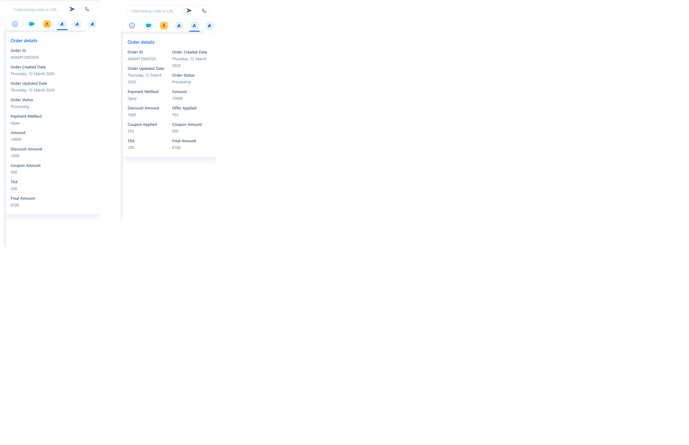

# Acquire-cards

## Introduction
Acquire cards are used to place containers around the respective set of information. The cards allow data display of external systems to be shown within the unified view of the Acquire. 
Acquire cards appear within the middle and right hand positions of the dashboard.
Acquire has 2 types of cards <strong>app-custom-cards</strong> and <strong>manual-cards</strong>.
Once the Acquire card is configured correctly, your external system information will appear in the Acquire Agent's dashboard.

#### Use case:
You use the Acquire and manage orders on an external system but the agent wants to see the status of the particular contact's order, then the agent can view, change the information in the Acquire dashboard without switching through the card.

Example of Card:



At the time of sending data through these cards, customer name, email, phone and other fields will be received from the Acquire, you can get that customer data from external systems.
<br>

### There are currently two types of custom card making:
* App Custom Card 
* Manual card 

#### Theme options
* Default template
* Custom HTML

#### Card Location
* Interaction-cards (Middle of agent dashboard)
* General-cards (Right-side of agent dashboard)

<br>

#### Supported Types & default template components schema

When creating a card, there is a collection of supported types that can be included in the schema. These types are essentially UI controls that interact to provide content or data to the user card.

|Name|description| Notes |
|---|---|---|
|<code>Text</code>|<strong>type</strong> - text<br><strong>text</strong> - this is demo text<br> <strong>displayStyle</strong> - header/paragraph <br> <strong>style</strong> - error/muted/success/normal <br><strong>align</strong> - right/left/center|Represents a paragraph|
|<code>Image</code>|<strong>type</strong> - image<br><strong>url</strong> - https://acquire.io<br> <strong>height </strong> - number [default 100%] <br> <strong>width</strong> - number [default 100%]<br><strong>align</strong> - right/left/center<br><strong>rounded</strong> - true/false (default -> false)|Embed an image|
|<code>Link</code>|<strong>type</strong> - link<br><strong>url</strong> - https://acquire.io<br> <strong>visibleText</strong> - text of redirect url<br> <strong>showLink</strong> - true/false (default -> false)|Define external resource|
|<code>List</code>|<strong>type</strong> - list<br><strong>items[]</strong> - array of items - <code><br>[<br><strong>type</strong> - item_list<br><strong>title</strong> - header text of list<br><strong>style</strong> - text<br><strong>title</strong> - text<br><strong>action</strong> - not required, if given (same as individual items action)<br> ]</code>|Defines the item in the list|
|<code>Data Table</code>|<strong>type</strong> - data-table<br><strong>title</strong> - any text<br> <strong>verticalAlign</strong> - top/middle/bottom (default-> top)<br> <strong>bordered</strong> - true/false (default -> false)<br> <strong>items</strong> - array of text to display<code><br>[<br><strong>type</strong> - item (required)<br><strong>key </strong> - text to display(required)<br><strong>value</strong> - text to display(required)<br><strong>style</strong> - same/dark/light/inverted (for formatting of both text-> diff color/dark color/light color)<br> ]</code><br><strong>style</strong> - list/table (default ->list)<br><strong>column</strong> - no of number (default 1) (only used when style is list)<br><strong>space</strong> - non-linear or none (default is linear)<br><strong>subTextAlign</strong> - left/right -> (default is left)|Tabular data entry|
|<code>Cards</code>|<strong>type</strong> - card<br><strong>style</strong> - single/vertical/horizontal (default horizontal)<br> <strong>items</strong> - array of item - <code><br>[<br><strong>type</strong> - item<br><strong>title</strong> - header text<br><strong>subtitle </strong> - paragraph text<br><strong>image</strong> - object <br>{<br><strong>url</strong> - img url<br><strong>width</strong> - number (default 100%)<br><strong>height</strong> - number (default 100%)<br><strong>rounded</strong> - true/false (default -> false)<br>}<br><strong>align </strong> - left/center/right (default-> left)<br><strong>action</strong> - same as other individual item<br><strong>text</strong> - array of text and style(same single object as text<br><strong>buttons </strong> - array of buttons same single object as button<br>]</code>| Content container |
|<code>Divider</code>|<strong>type</strong> - divider<br><strong>style</strong> - dotted/solid (default solid)<br> <strong>size</strong> - xs/x/m/l/xl (top bottom spaces)(default is m)<br> <strong>fullWidth</strong> - true/false (default false)|Divides a whole into parts vertical.|
|<code>spacer</code>|<strong>type</strong> - spacer<br><strong>size</strong> - dxs/s/m/l/xl|Create space|
|<code>Button</code>|<strong>type</strong> - button<br><strong>label</strong> - text to display<br> <strong>style</strong> - primary/secondary/link/muted/error/success/outlined  (default primary)<br> <strong>size</strong> - xs/s/m/l/xl (default m)<br> <strong>action</strong> - same as other individual item|Defines a clickable|
|<code>Feedback</code>|<strong>type</strong> - feedback<br><strong>label</strong> - string text to display<br> <strong>style</strong> - star/ thumbs<br> <strong>ratings</strong> - number (if style is star > if >5 then it will show max 5) (default is 5)|Rating picker|
|<code>Section</code>|<strong>type</strong> - section<br><strong>Items</strong> - array of components||
|<code>Json-to-html</code>|<strong>type</strong> - json-to-htm<br><strong>json</strong> - json object of html markdown||
|<code>Checkbox</code>|<strong>type</strong> - checkbox<br><strong>label</strong> - text to display<br><strong>value</strong> - <br><strong>items</strong> - array of checkbox item (label, value, checked)<br><strong>action</strong> - same as other individual item|Checkbox item list|
|<code>Input</code>|<strong>type</strong> - input/textarea<br><strong>label</strong> - text to display<br><strong>value</strong> - <br><strong>placeholder</strong> - <br><strong>action</strong> - same as other individual item|Specifies an input field where the user can enter data|
|<code>Radio</code>|<strong>type</strong> - radio<br><strong>label</strong> - text to display<br><strong>value</strong> - <br><strong>id</strong> - <br><strong>action</strong> - same as other individual item<br><strong>Items</strong> - array of radio item (label, value, checked)|Radio option list|
|<code>Single Select</code>|<strong>type</strong> - single-select<br><strong>label</strong> - text to display<br><strong>Items</strong> - array of item  to display in dropdown (label, value, id)|Single select dropdown list|
|<code>Badge</code>|<strong>type</strong> - badge<br><strong>text</strong> - text to display<br><strong>style </strong> - primary/success/error/warning/muted (default primary)<br><strong>bordered</strong> - true/false<br><strong>rounded</strong> -  true/false<br><strong>displayType</strong> - primary/secondary/advanced/advanced-secondary|Badges are used to add additional information to any content|
|<code>Grid</code>|<strong>type</strong> - grid<br><strong>header</strong> - array of header data<br><code>[{<br><strong>key </strong> -unique key for data (must be same for body data)<br><strong>text</strong> - text to display(required)<br><strong>width</strong> - to uniquely give width to columns (not required)<br>}]</code><br><strong>data</strong> - <code>[{array of body data}]</code><br><strong>title</strong> - title of the grid (not required)<br><strong>emptyChar</strong> - text to display when there is no data (not required)<br><strong>columnsWidth</strong> - same (for same width of columns ) (not required)|A grid consists of a parent element, with one or more child elements|

#### Text

#### Image

#### Link

#### Data Table

#### Cards

#### [divider | button | spacer | feedback]

```
app.post("/multi-initialize", (req, res, next) => {
          console.log('contact-information', req.body);
          res.send({
              "canvas": {
                  "content": {
                      "components": [
                          {
                              "type": "divider",
                              "style": "dotted", //dotted/solid (default solid)
                          },
                          {
                              "type": "spacer",
                              "size": "xl" // xs/x/m/l/xl (top bottom spaces)(default is m),
                              "fullWidth" : false //true/false (default false)
                          },
                          {
                              "type": "button",
                              "label": "Normal Button"
                          },
                          {
                              "type": "button",
                              "label": "Normal Button",
                              "style": "primary" //primary/secondary/link/muted/error/success/outlined  (default primary)
                          },
                          {
                              "type": "button",
                              "label": "Secondary button",
                              "style": "secondary"
                          },
                          {
                              "type": "spacer",
                              "size": "xl" // xs/s/m/l/xl (default m)
                          },
                          {
                              "type": "button",
                              "label": "Outlined button",
                              "style": "outlined"
                          },
                          {
                              "type": "button",
                              "label": "Link button",
                              "style": "link"
                          },
                          {
                              "type": "button",
                              "label": "Muted button",
                              "style": "muted"
                          },
                          {
                              "type": "button",
                              "label": "Error button",
                              "style": "error"
                          },
                          {
                              "type": "button",
                              "label": "Success button",
                              "style": "success"
                          },
                          {
                              "type": "spacer",
                              "size": "xl"
                          },
                          {
                              "type": "feedback",
                              "style": "star", //star/ thumbs
                              "label": "How good are you in frontend technologies",
                              "rating": 9 //number (if style is star > if >5 then it will show max 5) (default is 5)
                          },
                          {
                              "type": "feedback",
                              "style": "thumbs",
                              "label": "How good are you in backend technologies"
                          },
                          {
                              "type": "feedback",
                              "style": "thumbs",
                              "size": "l",
                              "label": "Thumbs rating variation"
                          }
                      ]
                  }
              }
          });
      });
```

#### Text
